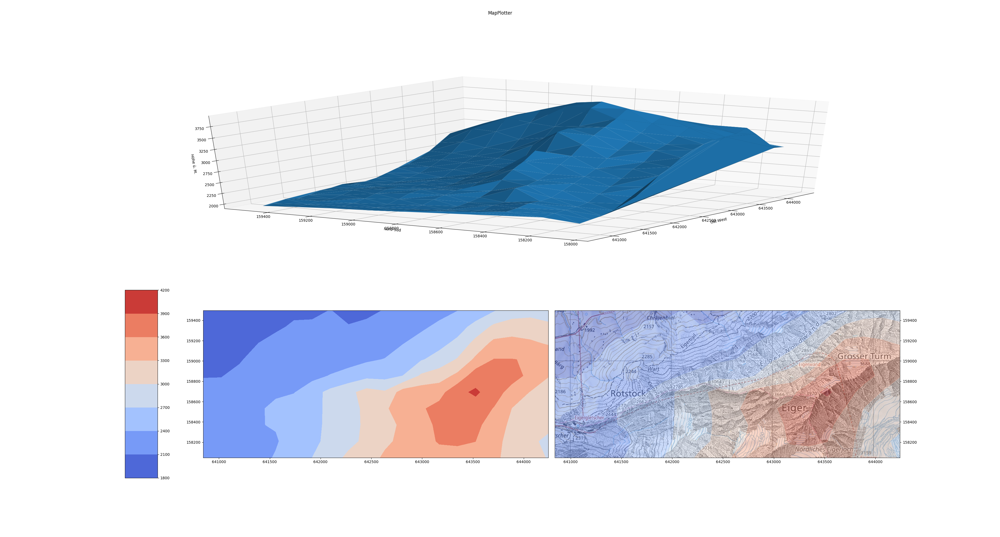

# MapPlotter
Let's you create 3D views from switzerland

## Installation
`git clone https://github.com/maede97/MapPlotter`

`cd MapPlotter`

`sudo apt install scrot`

`pip3 install -r mapplotter/requirements.txt`

## Usage Example
`python3 ex1.py` or `python3 ex2.py`
